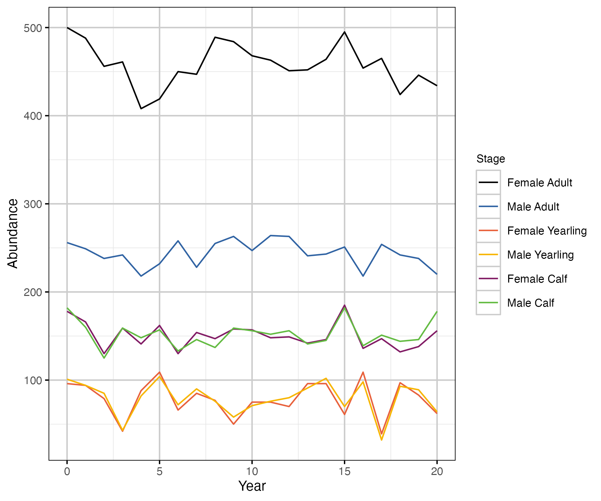
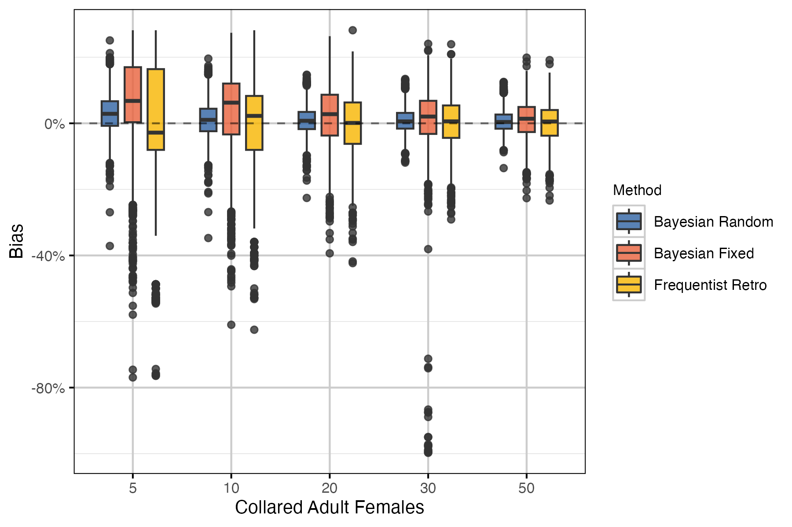
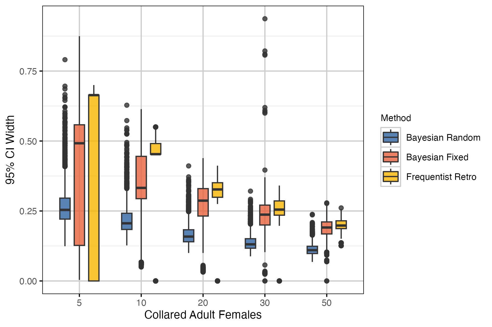
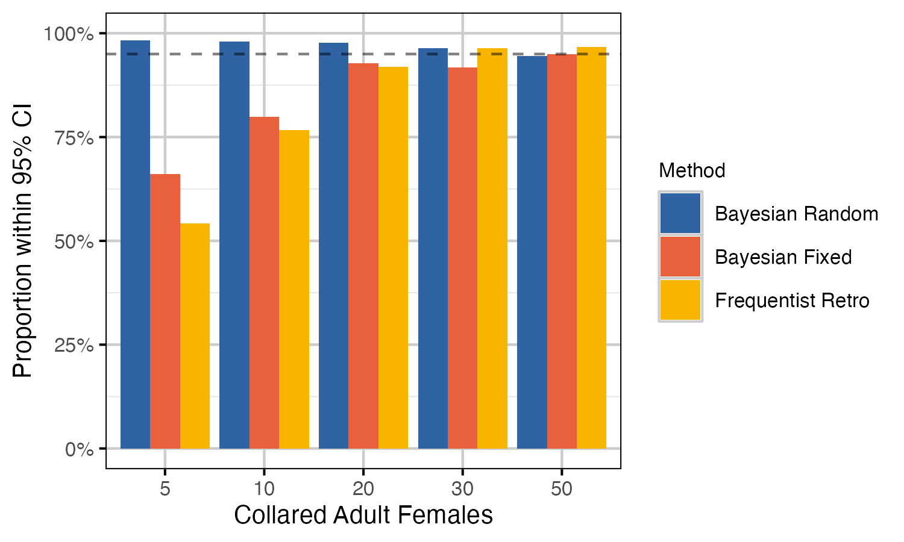
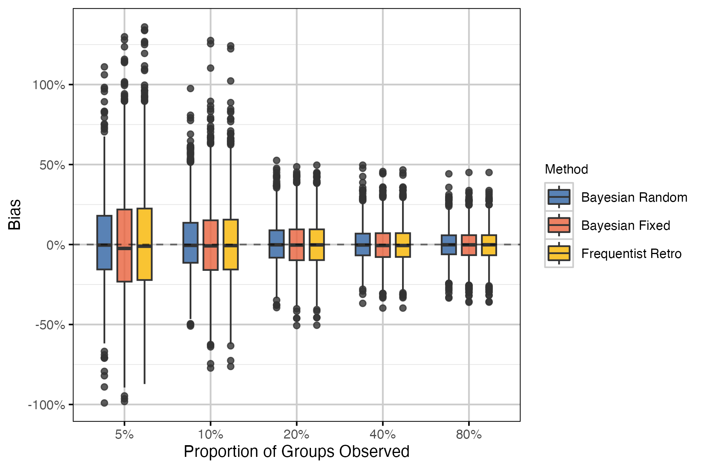
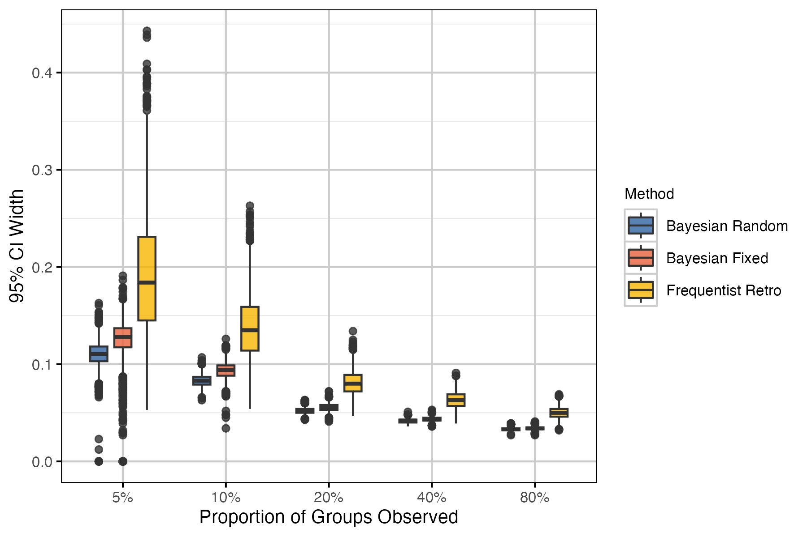
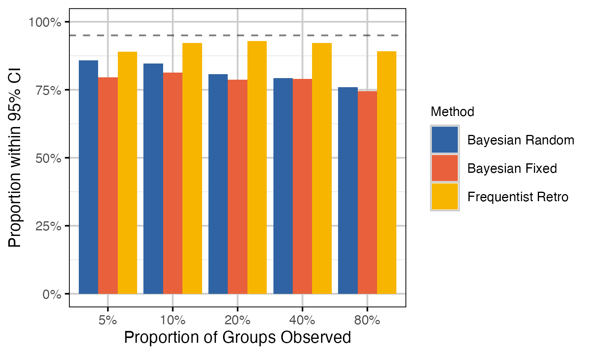
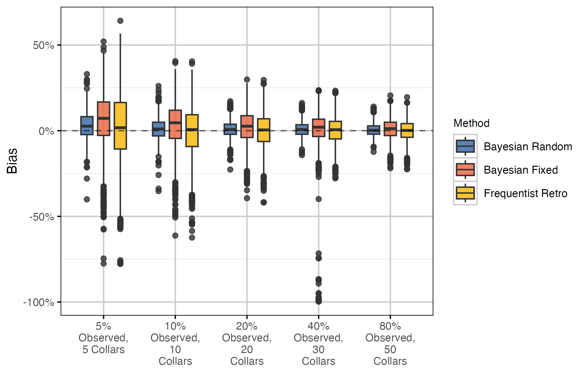
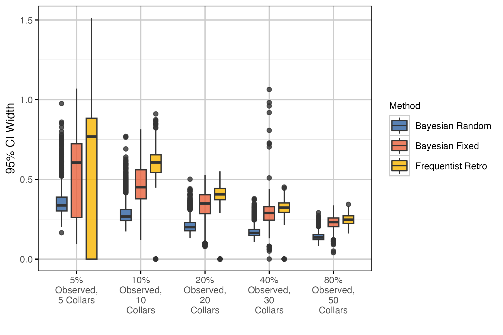
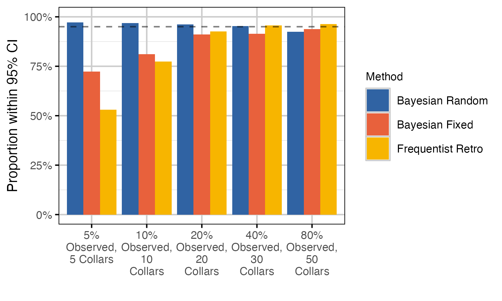

# Boreal Caribou Simulations Analysis

## Background

The objectives of this analysis are to:

- Simulate Boreal Caribou recruitment and survival data from key
  demographic and sampling parameters.  
- Assess the ability of various statistical methods to recover known
  parameter values from simulated data.

One hundred recruitment and survival data sets were simulated from a
single set of demographic (table 1) and sampling (table 2) parameters
for each of 5 coverage scenarios (table 3). Coverage scenarios included
variation in the number of collared adult females (for survival data)
and the proportion of groups observed in hypothetical composition
surveys (for recruitment data). Realistic parameter values for
survival/fecundity rates and population simulation were derived from
observed values in anonymized example datasets. The simulated population
is stable (i.e., lambda close to 1; table 4). See [this bbousims
vignette](https://poissonconsulting.github.io/bbousims/articles/bbousims.html)
for more information on how survival and recruitment data are simulated,
given the parameter values in table 1 and table 2.

Statistical methods compared include a Bayesian model with year as fixed
effect, a Bayesian model with year as random effect, and a frequentist
retro model. See [this bboutools
vignette](https://poissonconsulting.github.io/bboutools/articles/methods.html)
for more details on the statistical methods. All Bayesian models had
uninformative priors.

Performance metrics used include bias, precision and coverage. Bias is a
measure of the degree to which the estimate over- or under-estimates the
true value. An unbiased estimator is one for which the mean bias across
all estimates is zero. Precision is simply the difference between the
upper and lower limits of the 95% CI. Note that for Bayesian models CI
refers to the credible interval, whereas CI represents the confidence
interval in frequentist methods. Coverage is the proportion of estimates
for which the 95% CI contain the true value. All performance metrics are
visualized as boxplots, which display the median and 95% interquartile
range. Each boxplot is a summary of 2000 points (i.e., 100 simulations
by 20 years).

Frequentist retro methods fail to estimate standard error (and 95% CI)
for annual survival when there are 0 observed mortalities. In these
cases, the annual population growth (lambda) estimates are also missing
95% CI. It is important to note that the precision plots exclude these
values and the coverage plots assume that the known value is not within
the 95% CI. The number (and proportion) of these cases is summarized for
each coverage scenario in table 5 and 6.

## Results

### Population

Table 1. Parameter values for generation of survival and fecundity
rates.

| Parameter                                    | Value |
|:---------------------------------------------|------:|
| Survival Adult Female Intercept              |  0.86 |
| Survival Adult Female Annual SD              |  0.35 |
| Survival Adult Female Month SD               |  0.10 |
| Survival Adult Female Annual within Month SD |  0.01 |
| Survival Adult Female Trend                  |  0.00 |
| Survival Calf Female Intercept               |  0.50 |
| Survival Calf Female Annual SD               |  0.35 |
| Survival Calf Female Month SD                |  0.10 |
| Survival Calf Female Annual within Month SD  |  0.01 |
| Survival Calf Female Trend                   |  0.00 |
| Calves per Adult Female Intercept            |  0.70 |
| Calves per Adult Female Intercept Annual SD  |  0.00 |
| Calves per Adult Female Trend                |  0.00 |

Table 2. Parameter values for population simulation.

| Parameter                              | Value                  |
|:---------------------------------------|:-----------------------|
| Simulations                            | 100                    |
| Years                                  | 20                     |
| Initial Adult Females                  | 500                    |
| Proportion Adult Female                | 0.65                   |
| Proportion Yearling Female             | 0.5                    |
| Month Collared                         | 1                      |
| Month Composition Survey               | 9                      |
| Mean Group Size                        | 5                      |
| Minimum Group Size                     | 2                      |
| Probabiility Unsexed Adult Female      | 0.01                   |
| Probabiility Unsexed Adult Male        | 0.01                   |
| Group Coverage                         | 5%, 10%, 30%, 50%, 80% |
| Collared Adult Females                 | 5, 10, 20, 30, 50      |
| Probability Uncertain Collar Survival  | 0                      |
| Probability Uncertain Collar Mortality | 0.01                   |

Table 3. Scenarios for population simulation.

| survival_adult_female | coverage | group_coverage | collared_adult_females |
|----------------------:|---------:|---------------:|-----------------------:|
|                  0.86 |        1 |           0.05 |                      5 |
|                  0.86 |        2 |           0.10 |                     10 |
|                  0.86 |        3 |           0.30 |                     20 |
|                  0.86 |        4 |           0.50 |                     30 |
|                  0.86 |        5 |           0.80 |                     50 |

Table 4. Key demographic summary parameters for model Caribou population

| Parameter               |     Value |
|:------------------------|----------:|
| Lambda                  | 0.9916254 |
| Recruitment             | 0.1194539 |
| Calf-Cow Ratio          | 0.2713178 |
| Adult Female Survival   | 0.8600000 |
| Calf Survival           | 0.5000000 |
| Calves per Adult Female | 0.7000000 |

Figure 1. Population by stage for 100 simulations.

### Survival

Figure 2. Bias (% difference) in annual survival point estimates and
known survival for 100 simulations and 20 years, by sample size and
statistical method.

Figure 3. Precision (95% CI width) in estimated annual survival for 100
simulations and 20 years, by sample size and statistical method.
‘Frequentist Retro’ estimates with standard error of 0 are included with
CI width of 0. See table 5 for the number of estimates with SE of 0 in
each coverage scenario.

Figure 4. Proportion of the estimated annual survival 95% CI that
contains the known value for 100 simulations and 20 years, by sample
size and statistical method. In cases where the ‘Frequentist Retro’
estimated SE is 0, we assumed that the known value is outside the 95%
CI.

Table 5. Number and proportion (%) of annual survival estimates with no
standard error (SE is 0). This occurs with the ‘Frequentist Retro’
methods when there are 0 mortalities.

| Collars | No SE | % No SE |
|--------:|------:|--------:|
|       5 |   877 |   43.85 |
|      10 |   373 |   18.65 |
|      20 |    85 |    4.25 |
|      30 |    16 |    0.80 |
|      50 |     0 |    0.00 |

### Recruitment

Figure 5. Bias (% difference) in annual recruitment point estimates and
known survival for 100 simulations and 20 years, by proportion of groups
observed and statistical method.

Figure 6. Precision (95% CI width) in estimated annual recruitment for
100 simulations and 20 years, by proportion of groups observed and
statistical method.

Figure 7. Proportion of the estimated annual recruitment 95% CI that
contains the known value for 100 simulations and 20 years, by proportion
of groups observed and statistical method.

### Growth

Figure 8. Bias (% difference) in annual population growth (lambda) point
estimates and known survival for 100 simulations and 20 years, by
coverage scenario and statistical method.

Figure 9. Precision (95% CI width) in estimated annual population growth
(lambda) for 100 simulations and 20 years, by coverage scenario and
statistical method. ‘Frequentist Retro’ estimates with missing CI are
included with CI width of 0. See table 6 for the number of estimates
with missing CI in each coverage scenario.

Figure 10. Proportion of the estimated annual population growth 95% CI
that contains the known value for 100 simulations and 20 years, by
coverage scenario and statistical method. In cases where the estimate
was missing CI, we assumed that the known value is outside the 95% CI.
This occurs in the ‘Frequentist Retro’ method when there are 0
mortalities and estimated SE in survival is 0.

Table 6. Number and proportion (%) of annual population growth (lambda)
estimates with no CI due to missing survival SE. This occurs in the
‘Frequentist Retro’ method when there are 0 mortalities.

| Coverage                 | No CI | % No CI |
|:-------------------------|------:|--------:|
| 5% Observed, 5 Collars   |   877 |   43.85 |
| 10% Observed, 10 Collars |   373 |   18.65 |
| 20% Observed, 20 Collars |    85 |    4.25 |
| 40% Observed, 30 Collars |    16 |    0.80 |
| 80% Observed, 50 Collars |     0 |    0.00 |

## Discussion

For the survival model, higher sample size resulted in reduced bias,
higher precision and higher coverage for all statistical methods. The
Bayesian random effects model performed best, with improvement over
other methods particularly at lower sample sizes.

Results for the recruitment model were less clear, with methods
performing similarly across sample sizes. Surprisingly, coverage was
reduced with higher proportion of groups observed in the Bayesian
recruitment models. We suspect that this is caused by higher precision
leading to a higher tendency for the 95% CI to not include the true
value. Considering population growth estimates generally, the Bayesian
random effects model performed best.

The growth predictions are derived from the recruitment and survival
estimates and thus, it is unsurprising that the Bayesian random effects
model performed best.

A consequence of modeling year as a random effect is that individual
estimates are pulled in toward the grand mean, especially when estimates
have low precision or are more extreme (Kery and Schaub 2011). This
simulation analysis demonstrates that this ‘shrinkage’ is desirable as
the random effects model tends to be more skeptical of extreme values.
Extreme values are likely to result from the sampling process rather
than the ecological processes, especially at low sample sizes.

Kery, Marc, and Michael Schaub. 2011. *Bayesian Population Analysis
Using WinBUGS : A Hierarchical Perspective*. Academic Press.
[http://www.vogelwarte.ch/bpa.html](http://www.vogelwarte.ch/bpa.md).
