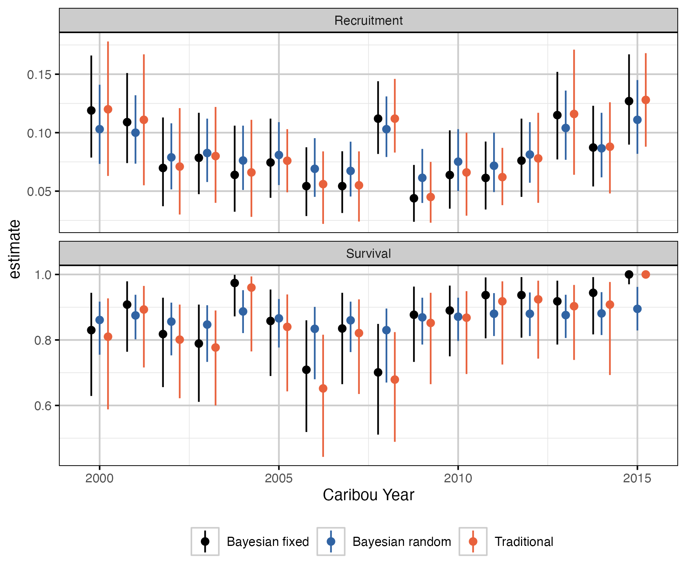

# Summary

Although many animal populations are managed based on their abundance [@williams_analysis_2002], reliable abundance estimates can be difficult to obtain for mobile herding populations with large ranges such as boreal caribou (*Rangifer tarandus caribou*).
Consequently, such populations are commonly managed based on their population growth rate ($\lambda$), which can be estimated from the population recruitment ($R$) and adult female survival ($S$) rates [@hatter_moose_1991] using the following equation. 

$$\lambda = \frac{S}{1- R}$$

The `bbou` suite is a set of R packages [@r_core_team_2023] to facilitate simulation and analysis of boreal caribou survival and recruitment data to estimate population growth.  

It consists of:  
- [`bboudata`](https://poissonconsulting.github.io/bboudata/), a collection of simulated and anonymized empirical survival and recruitment datasets.  
- [`bboutools`](https://poissonconsulting.github.io/bboutools/), a set of functions to estimate population growth in a Bayesian or Maximum Likelihood (ML) framework, implemented under the hood using the `Nimble` R package [@de_valpine_programming_2017].  
- [`bboushiny`](https://poissonconsulting.github.io/bboushiny/), a Graphical User Interface (GUI) to `bboutools` (\autoref{fig:bboushiny}).    
- [`bbouretro`](https://poissonconsulting.github.io/bbouretro/), a set of functions to estimate population growth using traditional frequentist methods.  
- [`bbousims`](https://poissonconsulting.github.io/bbousims/), a set of functions to simulate survival and recruitment data from hypothetical collaring and composition surveys.  

Each R package has a website with function documentation and a 'Get Started' guide.
There are also several vignettes, including on `bboutools` [analytical methods](https://poissonconsulting.github.io/bboutools/articles/methods.html) and [prior selection](https://poissonconsulting.github.io/bboutools/articles/priors.html); `bbouretro` [analytical methods](https://poissonconsulting.github.io/bbouretro/articles/retro-methods.html); using [`bbousims` with `bboutools`](https://poissonconsulting.github.io/bbousims/articles/bboutools.html); and comparison of Bayesian and traditional method estimates with [empirical](https://poissonconsulting.github.io/bbousuite/articles/empirical-comparisons.html) and [simulated](https://poissonconsulting.github.io/bbousuite/articles/simulations.html) data. 

# Statement of need

Boreal caribou are found in most provinces and territories in Canada and have been listed as threatened since 2003 [@ECCC_2023].
Each jurisdiction has their own monitoring program responsible for boreal caribou.
Numerous methods have been used to estimate population growth, which can make cross-jurisdictional conversations on the health of the species complex. 

The set of R packages in `bbousuite` aim to address this problem.
`bboutools` provides a standardized methodology with simple, general models and reasonable defaults for estimating survival, recruitment and population growth values that can be compared across jurisdictions.
In addition, `bboushiny` provides access to `bboutools` functionality in a GUI; `bbouretro` facilitates comparison with traditional methods; and `bbousims` facilitates comparison of various methods' ability to recover known parameter values from simulated data. 

There is an existing web-based application for estimating boreal caribou population growth rate [@eacker_webbased_2019]. 
We consider `bbousuite` to be an evolution of this application. 
The methods used are similar, but the `bboushiny` GUI is more user-friendly and `bboutools`, `bbouretro` and `bbousims` R packages provide more fine-grained control of analyses and the ability to compare methods. 

The `caribouMetrics` R package, and [associated shiny application](https://github.com/LandSciTech/BayesianCaribouDemographicProjection) have some overlapping functionality.  
However, the primary goal of these tools is to forecast boreal caribou population under different monitoring and disturbance scenarios [@dyson_2022].

# Overview of methods
## Survival
Survival is estimated from the monthly fate of collared adult females, with an option to include uncertain mortalites in the total monthly mortalities prior to model fitting. 

`bbouretro` uses the staggered entry Kaplan-Meier method [@pollock_survival_1989]. See [here](https://poissonconsulting.github.io/bbouretro/articles/retro-methods.html#survival-s) for more details. 

`bboutools` uses a generalized linear mixed-effects model (GLMM) approach. A survival model including a year random effect and trend takes the form
$$
\begin{aligned}
d_{ij} & \sim \text{Binomial}(1 - \widehat{S_{ij}}, r_{ij}) \\
\text{logit}(\widehat{{S}_{ij}}) & = \beta_{0} + \alpha_{i} + \delta_{j} + \beta_{1} \cdot Year_{j} \\
\alpha_{i} & \sim \text{Normal}(0, \sigma_{\alpha}) \\
\delta_{j} & \sim \text{Normal}(0, \sigma_{\delta}) \\
\end{aligned}
$$

where $d_{i,j}$ is the number of mortalities in the $i^{th}$ month and $j^{th}$ year, $r_{i,j}$ is the number of collared individuals at the start of the month, $\widehat{{S}_{ij}}$ is the survival probability, $\beta_{0}$ is the expected survival in year 0 in a typical month, $\alpha_i$ is a monthly random effect with SD $\sigma_{\alpha}$, $\delta_i$ is an annual random effect with SD $\sigma_{\delta}$ and $\beta_{1}$ represents the trend. 

## Recruitment
Recruitment is estimated from annual composition surveys.  

`bbouretro` follows methods in DeCesare et al. [-@decesare_estimating_2012]. See [here](https://poissonconsulting.github.io/bbouretro/articles/retro-methods.html#recruitment-r) for more details. 

`bboutools` uses a GLMM approach. A recruitment model including annual random effect and trend takes the form
$$
\begin{aligned}
Calves_{j} & \sim \text{Binomial}(X_{j}, AdultFemales_{j}) \\
\text{logit}(\delta_{j}) & = \beta_{0} + \alpha_{j} + \beta_{j} \cdot Year_{j} \\
\alpha_{j} & \sim \text{Normal}(0, \sigma_{\alpha}) \\
FemaleYearlings_{j} & \sim \text{Binomial}(sex\_ratio, Yearlings_{j}) \\
Cows_{j} & \sim \text{Binomial}(adult\_sex\_ratio, CowsBulls_{j}) \\
AdultFemalesOther_{j} & \sim \text{Binomial}(adult\_sex\_ratio, AdultsUnknown_{j}) \\
AdultFemales_{j} & = FemaleYearlings_{j} + Cows_{j} + AdultFemalesOther_{j} \\
\end{aligned}
$$

where $X_{j}$ is the calves per adult female in the $j^{th}$ year, $\delta_{j}$ is the expected calves per adult female in year $j$, $\beta_{0}$ is the expected calves per adult female in year 0, $\alpha_{j}$ is an annual random effect with SD $\sigma_{\alpha}$ and $\beta_{1}$ represents the trend. 

The model includes demographic stochasticity through the binomial distributions. 
Groups are aggregated by year prior to model fitting.
The sex ratio is fixed and can be adjusted by the user, with default of 0.5.
The adult female proportion can be estimated from counts of cows and bulls or fixed, with a default of 0.65, which accounts for higher mortality of males [@smith_2004].

In both `bbouretro` and `bboutools` estimated recruitment is the adjusted recruitment following DeCesare et al. [-@decesare_estimating_2012], which accounts for recruitment of calves into the yearling/adult age class at the end of the caribou year.

## Population growth
Population growth ($\lambda$) is estimated using the Hatter-Bergerud equation [@hatter_moose_1991] presented above. See additional details on `bbouretro` methods [here](https://poissonconsulting.github.io/bbouretro/articles/retro-methods.html#population-growth-lambda).

## Comparison of methods

A full comparison of `bboutools` and `bbouretro` statistical methods is beyond the scope of this paper. Some key differences include:  

- `bbouretro` variances are estimated using approximation formulas (survival) or bootstrap resampling methods; Uncertainty estimates are less precise and reliable than `bboutools`.  
- `bboutools` models can estimate uncertainty in survival for cases with 0 mortalities in a year.  
- `bboutools` models can include year as a random effect, where individual year effects are assumed to be drawn from a common underlying distribution and information is shared among years.  
- `bboutools` models can include an underlying trend.  

In addition, with `bboutools` models fit in a Bayesian framework:  
- models can incorporate prior knowledge, which is especially useful when data are sparse.  
- posterior distributions of parameters can be combined to produce derived parameters (e.g., population growth) with full information about uncertainty retained.  

We compared estimates from `bbouretro` and `bboutools` on anonymized empirical and simulated data.

[Empirical comparisons](https://poissonconsulting.github.io/bbousuite/articles/empirical-comparisons.html) demonstrate that `bbouretro` methods yield similar estimates to Bayesian fixed-effects models with uninformative priors (\autoref{fig:empirical}).
By default, `bboutools` uses uninformative priors and these can be adjusted by the user. 
Random effects model estimates tend to be less noisy than traditional and fixed effect model estimates, however.
This is explored in more detail below.

Data simulation (i.e., with `bbousims`) allows for comparison of various methods' ability to recover known parameter values (i.e., with bias, precision, coverage). We simulated 100 recruitment and survival datasets from a single, randomly generated, stable population over 20 years. 

[Our analysis](https://poissonconsulting.github.io/bbousuite/articles/simulations.html) demonstrates that the Bayesian random effects model generally performs best. 
For example, a plot of the of bias in point estimates of population growth shows that the random effects model has the greatest precision, especially at lower sample sizes (\autoref{fig:bias}).

Random effect models exhibit 'shrinkage', which causes more extreme estimates to be pulled towards the group mean, especially when underlying data are sparse [@kery_bayesian_2011].
With higher sample size in each group, the difference between random and fixed effects model estimates is diminished. 
The simulation analysis demonstrates that the tendency to be skeptical of extreme values at low sample sizes is desirable, as these values are likely to result from the sampling process rather than represent the true values. 

The Bayesian methods in `bboutools` are proposed as a standardized method for comparing estimates across jurisdictions.
In particular, the random effects model is recommended by default when there are $\geq$ 5 years of data [@kery_bayesian_2011]. 

# Acknowledgements

We acknowledge contributions from Alan Constant, Sarah Lyons, Colton Stephens and Nicole Hill.
Development of `bbousuite` was funded by the Province of Alberta and Environment and Climate Change Canada.

# References

