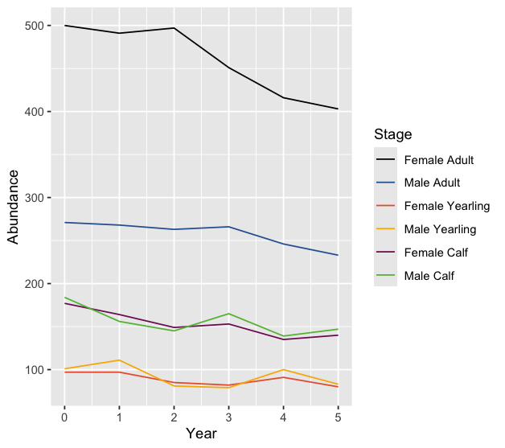

# Summary

Although many animal populations are managed based on their abundance [@williams_analysis_2002], in the case of mobile herding populations, such as boreal caribou (*Rangifer tarandus caribou*), which have large ranges, reliable abundance estimates can be impractical to obtain. 
Consequently, such populations are commonly managed based on their population growth rate ($\lambda$) which can be estimated from the population recruitment (R) and adult female survival (S) rates [@hatter_moose_1991]. 

The `bbou` suite of R packages is a set of R packages to facilitate analysis of Boreal Caribou survival and recruitment data to estimate population growth ($\lambda$).
The `bboushiny` R package provides a Graphical User Interface to `bboutools`.

# Statement of need

Boreal Caribou are found in most provinces and territories in Canada and have been listed as threatened since 2003 [@ECCC_2023]. 
Each jurisdiction has their own monitoring program responsible boreal caribou.
There are multiple methods that are found in literature for how to estimate population growth which can make cross jurisdictional conversations on the health of the species complex. 
The suite of tools in `bbousuite` allows jurisdictions to use simple standardized method for reporting population growth. 

There is an existing web-based application [@eacker_webbased_2019] for estimating population growth rate but users found it difficult to use if they were not familiar with Bayesian statistics and had too many options to be a standarized method. 

# Technical details

## bboudata

The `bboudata` R package provides sample survival and recruitment data for boreal caribou that can be used in various packages within the suite of tools.

## bbouretro

The `bbouretro` R package contains functions to calculate survival [@pollock_survival_1989], recruitment [@decesare_estimating_2012] and population growth [@hatter_moose_1991] using the classical methods.

## bboutools

The `bboutools` R packages uses the `Nimble` R package [@de_valpine_programming_2017] to fit models using maximum likelihood [@millar_maximum_2011] and Bayesian methods.

## bbousims

The `bbousims` R package allows users to simulate boreal caribou abundance over time from survival, ageing and birth processes. 

## bboushiny

The `bboushiny` R package is a R shiny app for estimating boreal caribou population growth using the Bayesian method from the `bboutools` package. 
`bboushiny` gives non-R users a way to utilize the functions from the `bboutools` package. 

## bbousuite

The `bbousuite` R package facilitates installing and loading the other packages.

# Example of use

To load all the packages you can use `library(bbousuite)` or each package can be loaded individually such as `library(bboudata)`.

```r
set.seed(101)
library(bbousuite)
print(bboudata::bbousurv_c, n = 5)
```

```r
# A tibble: 122 × 6
  PopulationName  Year Month StartTotal MortalitiesCertain MortalitiesUncertain
  <chr>          <int> <int>      <int>              <int>                <int>
1 C               2003     3          0                  0                    0
2 C               2003     4         10                  2                    0
3 C               2003     5          5                  0                    0
4 C               2003     6          5                  1                    0
5 C               2003     7          4                  0                    0
# ℹ 117 more rows
# ℹ Use `print(n = ...)` to see more rows
```

``` r
survival_est <-
  bbouretro::bbr_survival(
    bboudata::bbousurv_c,
    mort_type = "total",
    variance = "greenwood"
  )
  
recruitment_est <-
  bbouretro::bbr_recruitment(
    bboudata::bbourecruit_c,
    p_females = 0.65,
    sex_ratio = 0.5,
    variance = "bootstrap"
  )

growth_est <- bbouretro::bbr_growth(survival_est, recruitment_est)
bbouretro::bbr_growth_summarize(growth_est)
```

``` r
# A tibble: 9 × 13
  PopulationName CaribouYear     S     R estimate     se  lower  upper prop_lgt1
  <chr>                <int> <dbl> <dbl>    <dbl>  <dbl>  <dbl>  <dbl>     <dbl>
1 C                     2004 0.867 0.096    0.959  0.115  0.636  1.08      0.323
2 C                     2005 0.832 0.08     0.904  0.105  0.633  1.03      0.093
3 C                     2006 1     0.068    1.07  NA     NA     NA        NA    
4 C                     2007 0.458 0.059    0.487  0.128  0.262  0.766     0    
5 C                     2008 0.941 0.083    1.03   0.1    0.739  1.16      0.615
6 C                     2009 1     0.14     1.16  NA     NA     NA        NA    
7 C                     2010 0.926 0.158    1.1    0.085  0.877  1.23      0.854
8 C                     2011 0.96  0.112    1.08   0.075  0.872  1.16      0.861
9 C                     2012 0.924 0.133    1.07   0.072  0.875  1.15      0.808
# ℹ 4 more variables: mean_sim_survival <dbl>, mean_sim_recruitment <dbl>,
#   mean_sim_growth <dbl>, median_sim_growth <dbl>
```

``` r
surv_fit <- bboutools::bb_fit_survival(bboudata::bbousurv_c, quiet = TRUE)
recruit_fit <- bboutools::bb_fit_recruitment(bboudata::bbourecruit_c, quiet = TRUE)

bboutools::bb_predict_growth(surv_fit, recruit_fit)
```

``` r
# A tibble: 9 × 4
  CaribouYear estimate lower upper
        <int>    <dbl> <dbl> <dbl>
1        2004    1.06  0.879  1.12
2        2005    1.03  0.823  1.11
3        2006    1.09  1      1.13
4        2007    0.858 0.476  1.08
5        2008    1.07  0.942  1.13
6        2009    1.12  1.03   1.18
7        2010    1.1   0.957  1.18
8        2011    1.1   0.99   1.15
9        2012    1.09  0.963  1.16
```

``` r
survival <- bbousims::bbs_survival_caribou(
  survival_adult_female = 0.85,
  annual_sd_adult_female = 0.2,
  trend_adult_female = -0.1,
  month_sd_adult_female = 0.1,
  survival_calf_female = 0.5,
  yearling_effect = 0.05,
  nyear = 5
)

fecundity <- bbousims::bbs_fecundity_caribou(
  calves_per_adult_female = 0.7,
  annual_sd = 0.1,
  nyear = 5
)

population <- bbousims::bbs_population_caribou(survival,
  fecundity = fecundity,
  adult_females = 500,
  proportion_adult_female = 0.65
)

bbousims::bbs_plot_population(population)
```



``` r
bboushiny::run_bbou_app()
```


Additional examples and usage of each package can be on their websites. 

# Acknowledgements

We acknowledge contributions from Alan Constant.
Development of `bbousuite` was funded by the Province of Alberta and Environment and Climate Change Canada.

# References
