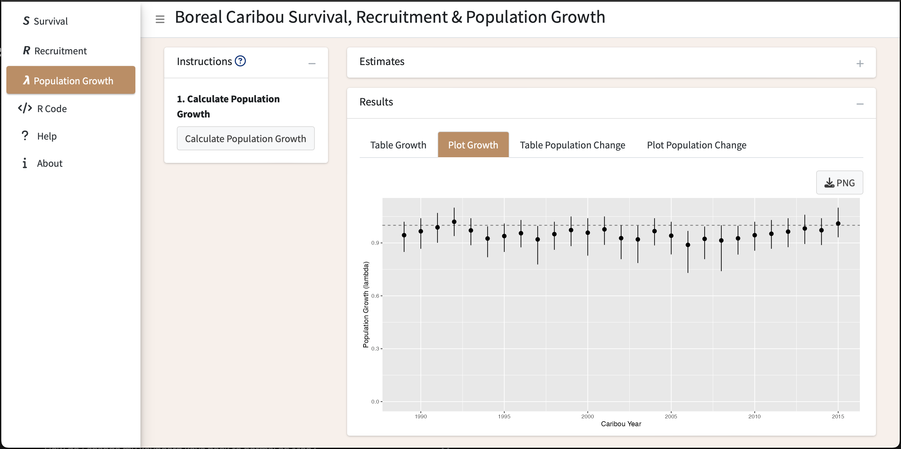
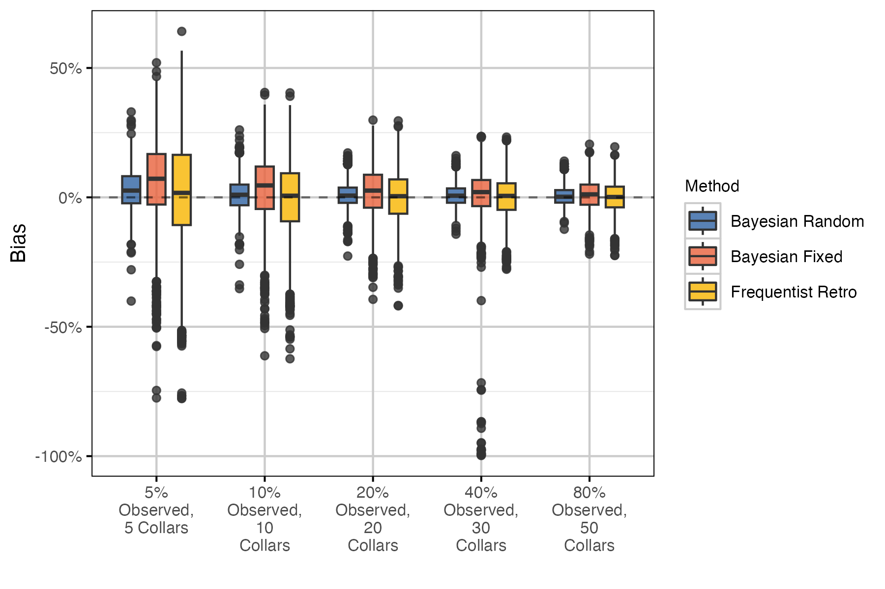

# Summary

Many animal populations are managed based on their abundance [@williams_analysis_2002]. However, reliable abundance estimates can be difficult to obtain for mobile low-density populations with large ranges such as boreal caribou (*Rangifer tarandus caribou*).
Such populations may be managed based on their population growth rate ($\lambda$), which can be estimated from the female population recruitment ($R$) and adult female survival ($S$) rates [@hatter_moose_1991; @Hatter_2020] using the following equation. 

$$\lambda = \frac{S}{1- R}$$

The `bbou`suite is a set of R packages [@r_core_team_2024] to facilitate simulation and analysis of boreal caribou survival and recruitment data to estimate population growth.  

It consists of:  

- [`bboudata`](https://poissonconsulting.github.io/bboudata/), a collection of simulated and anonymized empirical survival and recruitment datasets.  
- [`bboutools`](https://poissonconsulting.github.io/bboutools/), a set of functions to estimate population growth in a Bayesian or Maximum Likelihood (ML) framework, implemented under the hood using the `Nimble` R package [@de_valpine_programming_2017].  
- [`bboushiny`](https://poissonconsulting.github.io/bboushiny/), a Graphical User Interface (GUI) to `bboutools` (\autoref{fig:bboushiny}).    
- [`bbouretro`](https://poissonconsulting.github.io/bbouretro/), a set of functions to estimate population growth using traditional frequentist methods.  
- [`bbousims`](https://poissonconsulting.github.io/bbousims/), a set of functions to simulate survival and recruitment data from hypothetical radio-collaring and composition surveys.  

Each R package has a website with function documentation, a 'Get Started' guide and vignettes. 

# Statement of need

Boreal caribou occur in most provinces and territories in Canada, and are listed as threatened under Canada's Species at Risk Act [@ECCC_2023].
Each jurisdiction is responsible for monitoring their respective boreal caribou populations.
Numerous methods have been used to estimate population growth, which can complicate cross-jurisdictional comparisons on the status of the various populations. 

The set of R packages in `bbousuite` aims to address this challenge.
`bboutools` provides a standardized methodology with simple, general models and reasonable defaults for estimating survival, recruitment, and population growth that can be compared across jurisdictions.
In addition, `bboushiny` provides access to `bboutools` functionality in a GUI; `bbouretro` facilitates comparison with traditional methods; and `bbousims` facilitates comparison of various methods' ability to recover known parameter values from simulated data. 

There is an existing web-based application for estimating boreal caribou population growth rate [@eacker_webbased_2019]. 
We consider `bbousuite` to be an evolution of this application. 
The methods used are similar, but the `bboushiny` GUI is more stream-lined while the `bboutools`, `bbouretro`, and `bbousims` R packages provide more fine-grained control of analyses and the ability to compare methods. 

The `caribouMetrics` R package and [associated shiny application](https://github.com/LandSciTech/BayesianCaribouDemographicProjection) also have overlapping functionality. 
However, the primary goal of these tools is to forecast boreal caribou populations under different monitoring and disturbance scenarios [@dyson_2022].

# Overview of methods
Survival is estimated from the monthly fate of radio-collared adult females, with an option to include uncertain mortalites in the total monthly mortalities prior to model fitting. 
`bbouretro` uses the staggered entry Kaplan-Meier method [@pollock_survival_1989], as outlined in the [`bbouretro` methods article](https://poissonconsulting.github.io/bbouretro/articles/retro-methods.html#survival-s). 
`bboutools` uses a generalized linear mixed-effects model (GLMM) approach. A full model description can be found in the [`bboutools` methods article](https://poissonconsulting.github.io/bboutools/articles/methods.html#survival-model).

Recruitment is estimated from annual aerial composition surveys. 
`bbouretro` follows methods in DeCesare et al. [-@decesare_estimating_2012], as outlined in the [`bbouretro` methods article](https://poissonconsulting.github.io/bbouretro/articles/retro-methods.html#recruitment-r). 
`bboutools` uses a GLMM approach. A full model description can be found in the [`bboutools` methods article](https://poissonconsulting.github.io/bboutools/articles/methods.html#recruitment-model).
The model includes demographic stochasticity through the binomial distributions. 
Groups are aggregated by year prior to model fitting.
The calf sex ratio is fixed and can be adjusted by the user, with default of 0.5.
The female proportion of the adult population can be estimated from counts of cows and bulls or fixed, with a default of 0.65, which accounts for higher mortality of males [@smith_2004].
In `bbouretro` and `bboutools`, estimated recruitment is the female calf recruitment, adjusted following DeCesare et al. [-@decesare_estimating_2012], which accounts for recruitment of calves into the yearling/adult age class at the end of the caribou year.

Population growth ($\lambda$) is estimated using the Hatter-Bergerud equation [@hatter_moose_1991] presented above. More details can be found in the [`bbouretro` methods article](https://poissonconsulting.github.io/bbouretro/articles/retro-methods.html#population-growth-lambda).

## Comparison of methods

Some key differences between `bbouretro` and `bboutools` include:  

- `bbouretro` variances are estimated using approximation formulas (survival) or bootstrap resampling methods. Uncertainty estimates are less precise and reliable than `bboutools`.  
- `bboutools` models can estimate uncertainty in survival for cases with 0 mortalities in a year.  
- `bboutools` models can include year as a random effect, where individual year effects are assumed to be drawn from a common underlying distribution and information is shared among years.  
- `bboutools` models can include an underlying trend.  

In addition, with `bboutools` models that are fit in a Bayesian framework:  

- models can incorporate prior knowledge, which is especially useful when data are sparse.  
- posterior distributions of parameters can be combined to produce derived parameters (e.g., population growth) with full information about uncertainty retained.  

We compared estimates from `bbouretro` and `bboutools` on anonymized empirical and simulated data.
Comprehensive results and discussion can be found in the [empirical comparisons article](https://poissonconsulting.github.io/bbousuite/articles/empirical-comparisons.html) and [simulations analysis article](https://poissonconsulting.github.io/bbousuite/articles/simulations.html), respectively.
Based on our findings (e.g., \autoref{fig:bias}), we propose `bboutools` as a standardized method for comparing estimates across jurisdictions. 
In particular, random effects models are recommended by default when there are $\geq$ 5 years of data [@kery_bayesian_2011]. 
More discussion on the benefits of random effects models can be found [in the simulations analysis article](https://poissonconsulting.github.io/bbousuite/articles/simulations.html#discussion).

# Acknowledgements

We acknowledge contributions from Alan Constant, Sarah Lyons, Colton Stephens and Nicole Hill.
Development of `bbousuite` was funded by the Province of Alberta and Environment and Climate Change Canada.

# References

