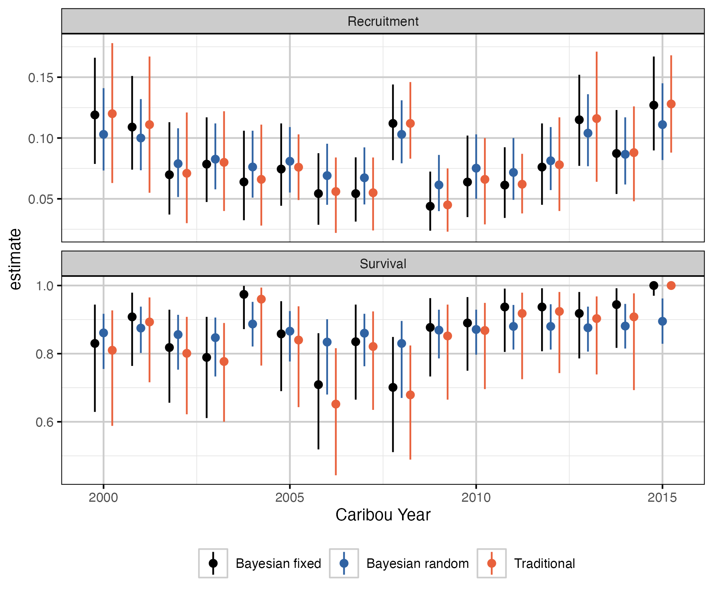

# Summary

Although many animal populations are managed based on their abundance [@williams_analysis_2002], reliable abundance estimates can be impractical to obtain for mobile herding populations with large ranges such as boreal caribou (*Rangifer tarandus caribou*).
Consequently, such populations are commonly managed based on their population growth rate ($\lambda$), which can be estimated from the population recruitment and adult female survival rates [@hatter_moose_1991]. 

The `bbou` suite is a set of R packages to facilitate simulation and analysis of Boreal Caribou survival and recruitment data to estimate population growth ($\lambda$).
It consists of:  
- [`bboudata`](https://poissonconsulting.github.io/bboudata/), a collection of real (anonymized) and simulated survival and recruitment data.  
- [`bboutools`](https://poissonconsulting.github.io/bboutools/), functions for estimating survival, recruitment and population growth in a Bayesian or Maximum Likelihood (ML) framework, implemented under the hood using the `Nimble` R package [@de_valpine_programming_2017].  
- [`bboushiny`](https://poissonconsulting.github.io/bboushiny/), a Graphical User Interface (GUI) to `bboutools` functionality (figure 1).    
- [`bbouretro`](https://poissonconsulting.github.io/bbouretro/), functions for estimating survival, recruitment and population growth using traditional frequentist methods.  
- [`bbousims`](https://poissonconsulting.github.io/bbousims/), functions to simulate survival and recruitment data from hypothetical collaring and composition surveys.  

Each R package has a website with function documentation and a 'Get Started' guide.
There are also several vignettes, including on `bboutools` [analytical methods](https://poissonconsulting.github.io/bboutools/articles/methods.html) and [prior selection](https://poissonconsulting.github.io/bboutools/articles/priors.html); `bbouretro` [analytical methods](https://poissonconsulting.github.io/bbouretro/articles/retro-methods.html); using [`bbousims` with `bboutools`](https://poissonconsulting.github.io/bbousims/articles/bboutools.html); comparison of Bayesian and traditional methods using [empirical](https://poissonconsulting.github.io/bbousuite/articles/empirical-comparisons.html) amd [simulated](https://poissonconsulting.github.io/bbousuite/articles/simulations.html) data. 

*Figure 1. bboushiny GUI.*

# Statement of need

Boreal caribou are found in most provinces and territories in Canada and have been listed as threatened since 2003 [@ECCC_2023].
Each jurisdiction has their own monitoring program responsible for boreal caribou.
Numerous methods have been used to estimate population growth, which can make cross-jurisdictional conversations on the health of the species complex. 

The suite of R packages in `bbousuite` aims to address this.
`bboutools` provides a standardized methodology with simple, general models and sensible defaults for estimating survival, recruitment and population growth that can be compared across jurisdictions.
In addition, `bboushiny` provides access to basic `bboutools` functionality in a GUI; `bbouretro` facilitates comparison with traditional methods; and `bbousims` provides tools to simulate data and facilitates comparison of various methods' ability to recover known parameter values. 

There is an existing web-based application for estimating boreal cariboupopulation growth rate [@eacker_webbased_2019]. 
However, users reported that it was difficult to use, especially if not familiar with Bayesian statistics, and had too many options to be considered a standarized method. 
There is also an existing R package, `caribouMetrics`, and associated R package to run a GUI, `BayesianCaribouDemographicProjection` with some shared functionality.  
However, the primary goal of these tools is to forecast boreal caribou population under different monitoring and disturbance scenarios [@dyson_2022].

# Overview of methods

Despite key methodological differences (explained below), `bboutools` and `bbouretro` use the same underlying formulas to estimate survival, recruitment and population growth. 
Survival is estimated from the monthly fate of collared adult females using the staggered entry Kaplan-Meier method [@pollock_survival_1989], with an option to include uncertain mortaliites in the total mortalities summed prior to model fitting. 
Recruitment is estimated from annual composition surveys following methods in DeCesare et al. [-@decesare_estimating_2012], where the adjusted recruitment accounts for recruitment of calves into the yearling/adult age class at the end of the caribou year.
Population growth ($\lambda$) is estimated using the Hatter-Bergerud method [@hatter_moose_1991].
More details can be found in [this vignette](https://poissonconsulting.github.io/bbousuite/articles/empirical-comparisons.html). 
Both `bboutools` and `bbouretro` allow the user to adjust the start month of the biological year and data are aggregated by biological year prior to model fitting.

A full comparison of the statistical methods used in `bboutools` and `bbouretro` is out of scope here.
However, a key difference is that `bboutools` methods are parametric, while `bbouretro` methods are non-parametric. 
Parametric methods assume that the data are drawn from a pre-defined statistical distribution, i.e., the binomial distribution in the case of survival and recruitment models. 
Inference is based on the underlying statistical model, which allows for inference on statistical significance of model parameters. 
For the non-parametric methods in `bbouretro`, which do not assume an underlying statistical model, estimates are based on simple ratios, with variances estimated using approximation formulas (survival) or bootstrap resampling methods. 

Advantages of the parametric approach include:   
- year can be modeled as a random effect, where parameter values are assumed to be drawn from a common underlying distribution and information is shared among years.  
- models can include estimation of an underlying trend.  
- uncertainty around survival estimates can be estimated in cases with 0 mortalities in a year (where this is not possible in `bbouretro`).  

In addition, advantages of using a Bayesian framework include:  
- models can incorporate prior knowledge, which is especially useful when data are sparse.  
- posterior distributions of parameters can be combined to produce derived parameters (e.g., population growth) with full information about uncertainty retained.  

A `bboutools` survival model including a year random effect and trend takes the form
$$
\begin{aligned}
d_{ij} & \sim \text{Binomial}(1 - \widehat{S_{ij}}, r_{ij}) \\
\text{logit}(\widehat{{S}_{ij}}) & = \beta_{0} + \alpha_{i} + \delta_{j} + \beta_{1} \cdot Year_{j} \\
\alpha_{i} & \sim \text{Normal}(0, \sigma_{\alpha}) \\
\delta_{j} & \sim \text{Normal}(0, \sigma_{\delta}) \\
\end{aligned}
$$

where $d_{i,j}$ is the number of mortalities in the $i^{th}$ month and $j^{th}$ year, $r_{i,j}$ is the number of collared individuals at the start of the month, $\wide{hat{S}_{ij}}$ is the survival probability, $\alpha_i$ is a monthly random effect with SD $\sigma_{\alpha}$, $\delta_i$ is an annual random effect with SD $\sigma_{\delta}$ and $\beta_{1}$ represents the trend. 

A `bboutools` recruitment model including annual random effect and trend takes the form
$$
\begin{aligned}
Calves_{j} & \sim \text{Binomial}(X_{j}, AdultFemales_{j}) \\
\text{logit}(\delta_{j}) & = \beta_{0} + \alpha_{j} + \beta_{j} \cdot Year_{j} \\
\alpha_{j} & \sim \text{Normal}(0, \sigma_{\alpha}) \\
FemaleYearlings_{j} & \sim \text{Binomial}(sex\_ratio, Yearlings_{j}) \\
Cows_{j} & \sim \text{Binomial}(adult\_sex\_ratio, CowsBulls_{j}) \\
AdultFemalesOther_{j} & \sim \text{Binomial}(adult\_sex\_ratio, AdultsUnknown_{j}) \\
AdultFemales_{j} & = FemaleYearlings_{j} + Cows_{j} + AdultFemalesOther_{j} \\
\end{aligned}
$$

where $X_{j}$ is the calves per adult female in the $j^{th}$ year, $\alpha_{j}$ is an annual random effect with SD $\sigma_{\alpha}$ and $\beta_{1}$ represents the trend. 

The model includes demographic stochasticity. 
Groups are aggregated by year prior to model fitting.
The sex ratio is fixed and can be adjusted by the user, with default of 0.5.
The adult female proportion can be estimated from counts of cows and bulls or fixed, with a default of 0.65, which accounts for higher mortality of males.

Models are identical for ML and Bayesian frameworks, although methods for parameter estimation and interpretation of uncertainty differ, prior information can be incorporated in the Bayesian framework, and prediction of derived parameters with uncertainty (e.g., population growth) is not implemented for ML.

We compared estimates from `bbouretro` and `bboutools` methods on [empirical data](https://poissonconsulting.github.io/bbousuite/articles/empirical-comparisons.html).
`bbouretro` methods yield similar estimates to Bayesian fixed-effects models with uninformative priors.
As well, ML and Bayesian models yield similar estimates with uninformative priors.
By default, `bboutools` uses uninformative priors and these can be adjusted by the user. 
Estimates from random effects models tend to differ from traditional and fixed effect models. 
This is explored in more detail below.

Data simulation (i.e., with `bbousims`) allows for comparison of various methods' ability to recover known parameter values. 
[We compared](https://poissonconsulting.github.io/bbousuite/articles/simulations.html) `bbouretro` methods with `bboutools` Bayesian models with fixed or random year effects. 

  
*Figure 2. Comparison of traditional and Bayesian estimates of survival, recruitment and λ by year.*

In general, the Bayesian random effects model performed best. 
Figures 3 shows the distribution of bias in estimates of population growth from 100 simulations, 20 years and 5 sample size scenarios. 
The random effects model has the smallest spread in bias, especially at lower sample sizes.

*Figure 3. Bias (% difference) in annual survival point estimates and known survival for 100 simulations and 20 years, by sample size and statistical method.*

Random effect models exhibit 'shrinkage', which causes more extreme estimates to be pulled towards the grand mean [@kery_bayesian_2011].
This is particularly true when underlying data are sparse.
With higher sample size in each group, the difference between random and fixed effects model estimates is diminished. 
The simulation analysis demonstrates that the tendency to be skeptical of extreme values at low sample sizes is desirable, as these values are likely to result from the sampling process rather than represent the true values. 

The Bayesian methods in `bboutools` are proposed as a standardized method for comparing estimates across jurisdictions.  
In particular, the random effects model is recommended by default when there are $\geq$ 5 years of data [@kery_bayesian_2011]. 

# Acknowledgements

We acknowledge contributions from Alan Constant.
Development of `bbousuite` was funded by the Province of Alberta and Environment and Climate Change Canada.

# References
