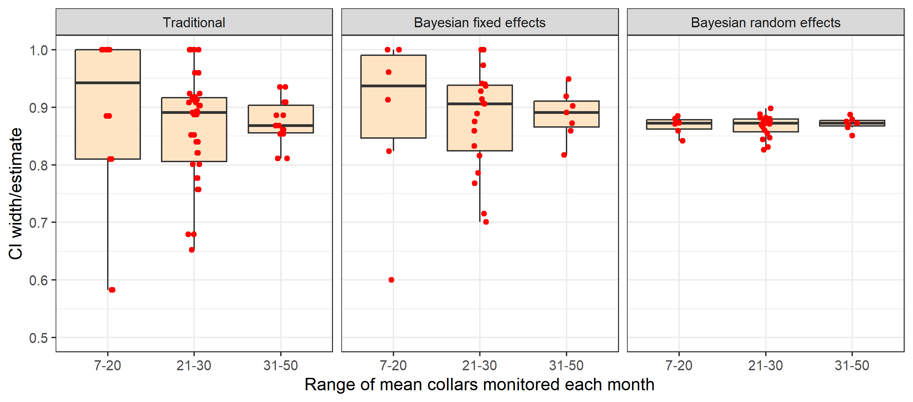
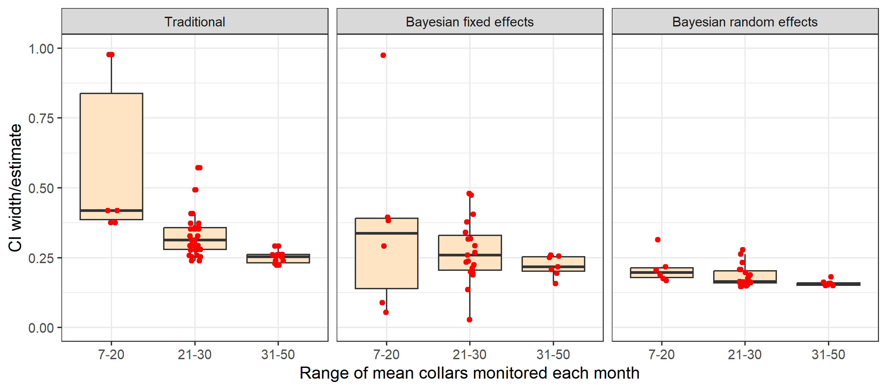

```{r, include = FALSE}
knitr::opts_chunk$set(
  collapse = TRUE,
  comment = "#>"
)
```

# Introduction

The overall objective of empirical comparisons is to explore the working characteristics of the Bayesian Hatter-Bergerud method for estimation of trend.
This methodology is an evolution of the traditional simulation-based approach and therefore practitioners will be interested in how the Bayesian methods perform relative to the traditional methods. 
A key objective is understanding how Bayesian approaches may offset low sample sizes of observations (collared caribou or groups observed during composition surveys) which is typical of caribou data sets. 

We note that empirical comparisons are limited in that true parameter values are not known. 
Therefore, we can only conclude whether estimates are similar or different between approaches rather than infer bias. 
To fully explore estimators we also present [simulations](https://poissonconsulting.github.io/bbousuite/articles/simulations.html) which allow assessment of bias and working characteristics across a full range of scenarios. 

# Methods and results

We first detail the methods that are used to estimate survival, recruitment and λ.
We then compare field-based estimates from Bayesian and traditional approaches. 
Finally, we use simulations to further explore performance of each approach. 

## Differences and similarities in traditional and Bayesian approaches

A key difference in traditional, fixed effect, and random effects methods is how yearly and monthly estimates are treated.
When a categorical variable, such as year or month is treated as a *fixed* effect each parameter value is estimated in isolation. 
Traditional methods treat variables as fixed effects. 
In contrast, when variables are treated as a *random* effect the parameter values are assumed to be drawn from a common underlying distribution which allows the typical values to be estimated and each parameter estimate to be influenced by the other ones.

The other difference in traditional and Bayesian approaches is whether the data is assumed to come from a pre-defined statistical distribution. 
Traditional approaches are *non-parametric* meaning they do not assume the data comes from any statistical distribution with estimates based on simple ratios. 
Variances are then estimated using approximation formulas (survival) or bootstrap resampling methods. 
Bayesian fixed and random effects model survival and recruitment use a *parametric* approach with survival and recruitment modeled using a binomial distribution. 
The main advantage of the Bayesian fixed and random effects models is that inference is based on an underlying statistical model allowing inference on statistical significance of model parameters.
For example, models that assume an underlying trend in demographic parameters can be applied using the parametric approach. 
In addition, estimates of standard error can be derived for years with 0 mortalities using fixed effects models in comparison with traditional approaches where a confidence interval is not possible.


## Review of formulas used to estimate survival, recruitment, and trend.

### Survival, $S$

Traditional and Bayesian methods use the staggered entry Kaplan-Meier method, which is defined algebraically below [@pollock_survival_1989]. 
The probability of surviving in the $i$th time step (usually month) is given by the equation below 

$$ \hat{S}_{i} = 1 - \frac{d_{i}}{r_{i}} $$

where $d_{i}$  is the number of mortalities during the period and  $r_{i}$ is the number of collared individuals at the start of period.
The estimated survival for any arbitrary time period $t$  (usually year) is given by

$$ \hat{S}(t) = \prod_{i=1}(\hat{S}_{i,t}) $$

where $S$ is the survival during the $i$th time step of the $t$th period.
Traditional approaches use the simple product of monthly survival estimates to obtain yearly survival estimates.
Bayesian approaches model survival based on binomial distribution.
Fixed effects Bayesian models treat monthly survival as a random effect with yearly survival as a fixed effect meaning that a parameter is estimated for every year.
Further details on the Kaplan-Meier approach as applied in boreal caribou studies are given in `vignette("previous-methods")`.

### Recruitment, $R$

Both traditional and Bayesian approaches estimate recruitment following the methods of DeCesare et al. [-@decesare_estimating_2012].
The age ratio, $X$, is commonly estimated as the number of calves, $n{_j}$, per adult female, $n_{af}$, observed at the end of a measured year, such that 

$$X = \frac{n_j}{n_{af}}$$ 

where $X \cdot sex\_ratio$ estimates the number of female calves $(n_{jf})$ per adult female. 

Recruitment is estimated using the equation below which accounts for recruitment of calves into the yearling/adult age class at the end of the caribou year.

$$R_{RM} = \frac{X \cdot sex\_ratio}{1 + X \cdot sex\_ratio}$$

For traditional methods,  estimates are based upon the raw ratios from field data whereas recruitment is modelled based on a binomial distribution for Bayesian methods.

### Population Growth, $\lambda$

Both traditional and Bayesian approaches use the basic Hatter-Bergerud method [@hatter_moose_1991].

The basic Hatter-Bergerud equation used to estimate $\lambda$ is given below.

$$\lambda = \frac{(S)}{(1 - R)}$$
Variance for lambda estimates is estimated using a simulation approach for traditional approach whereas variances are estimates using Markov Monte Carlo methods for Bayesian approaches.
The resulting estimates and variances are influenced by individual assumptions made in estimation of survival and recruitment.   

## Empirical comparisons

We use a 32 year field data set (data set "A" in [`bboudata`](https://poissonconsulting.github.io/bboudata/)) to compare methodologies. 
For this data we use [`bbouretro`](https://poissonconsulting.github.io/bbouretro/) to estimate traditional and [`bboutools`](https://poissonconsulting.github.io/bboutools/) to estimate fixed and random effects survival, recruitment, and trend.

A comparison of estimates reveals similarity between fixed effect and traditional estimates (Figure 1). 
This result is intuitive given that both approaches are treating years as independent data sets and given that the underlying formulae from the 2 approaches are similar.
The main difference is between random effects and traditional/fixed effect estimates.
In this case it can be seen that the distribution of random effect estimates is truncated with lower estimates from random effects models being higher than traditional/random effects and vice versa for higher estimates.
This is due to “shrinkage” of estimates.
Namely, the sharing of information across years by random effects estimates causes outlier estimates to be brought towards the mean random effect value. This is particularly the case when the underlying data from estimates is sparse.
For example, the lowest estimate of survival (0.6) was based on a mean sample size of 7.2 collars monitored per year.

```{r out.width = '100%', echo = FALSE}
knitr::include_graphics("figures/Fig1.bmp")
```
*<font size="-1">Fig. 1: Comparison of traditional and Bayesian estimates of survival, recruitment and λ.</font>*

A yearly plot reveals similar trends with random effects estimates showing the least variation compared to traditional and fixed effects estimates (Figure 2).
Most notable are difference in 1990 and 1991 where collar sample sizes were lower (<10 collars monitored per month) creating estimates of survival at or near 1 for traditional and fixed effects estimates.
However, all methods follow the general temporal trends in estimates.

```{r out.width = '100%', echo = FALSE}
knitr::include_graphics("figures/Fig2.bmp")
```
*<font size="-1">Fig. 2: Comparison of traditional and Bayesian estimates of survival, recruitment and λ by year.</font>*

Of additional interest is the relative precision of estimates as indicated by the width of the confidence interval divided by the estimate.
A comparison of traditional and Bayesian fixed and random effects reveals higher estimated precision for random effect estimators whereas estimated precision of fixed effect and traditional approaches is relatively similar (Figure 3).

```{r out.width = '100%', echo = FALSE}
knitr::include_graphics("figures/Fig3.bmp")
```
*<font size="-1">Fig. 3: Relative estimated precision of traditional, random and fixed effects methods.  Precision is indexed by the width of the confidence limit divided by the estimate.</font>*

One of the main factors influencing estimate precision is sample size of the data set used to obtain estimates.
The influence of sample size was explored for survival rate estimates by plotting the mean number of collars monitored in comparison to point estimates and relative precision of estimates as indexed by confidence interval width divided by the estimate.
This comparison reveals how traditional and Bayesian fixed effects are more influenced by sample size in terms of point estimates (Figure 4) and estimated precision (Figure 5) compared to random effects models.
When sample sizes a larger range of survival rates result including unrealistically low or high estimates with traditional and fixed effects models.

```{r out.width = '100%', echo = FALSE}

```
*<font size="-1">Fig. 4: Comparison of the effect of mean collars monitored on point estimates of survival from traditional and Bayesian random and fixed effect estimators.</font>*

Relative precision of estimates is also influenced by sample size of collars with both traditional and fixed effects methods (Figure 5).
Differences in estimated precision for fixed effects and traditional models are partially caused by fixed effects models estimating a confidence limit when survival estimates are 1 (no deaths).

```{r out.width = '100%', echo = FALSE}

```

*<font size="-1">Fig. 5: Comparison of the effect of mean collars monitored on point estimates of survival from traditional and Bayesian random and fixed effect estimators.</font>*

The main reason for differences in estimates is that traditional and fixed effects approaches consider each yearly data set independently whereas random effects models consider the entire multi-year data set (as being drawn from a distribution of survival values).
As a result, estimates are more stable from random effects models.

# Discussion

Empirical comparisons illustrate the potential advantages of using random effects methods to estimate survival, recruitment, and trend.
Namely, sharing of information across years with random effects models potentially offsets issues with sparse data creating unrealistic estimates with traditional and fixed effect approaches.
The main question is whether there are cases where random effects may create bias by dismissing low or high parameter estimates when they are actually occurring.
To explore this question as well as overall performance of estimators we use [simulations](https://poissonconsulting.github.io/bbousuite/articles/simulations.html).
Unlike empirical comparisons, simulations allow assessment of performance with known true parameter values therefore allowing further assessment of overall estimate performance.

## References
